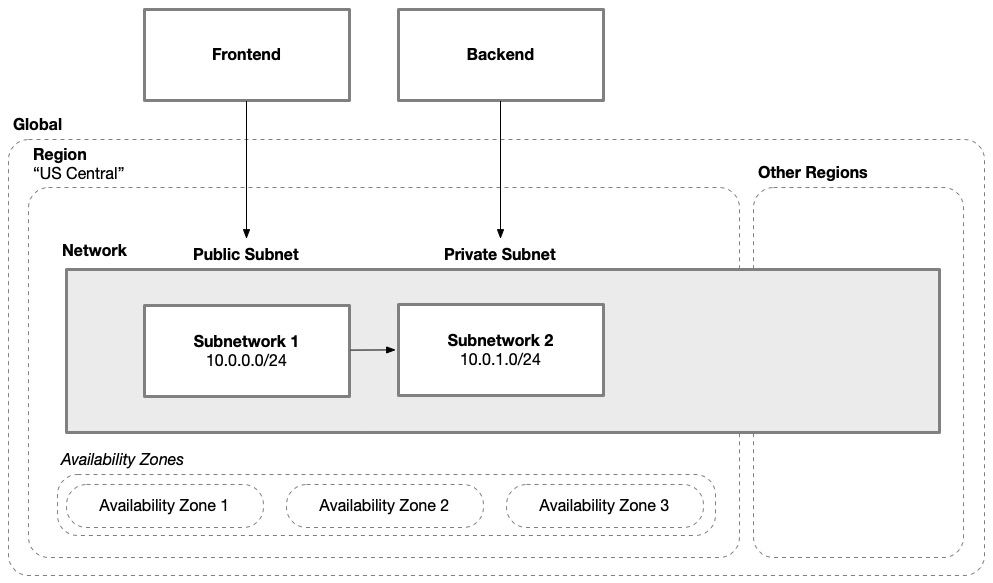

Cloud architecture
we need a project within the organization where a service account can be created for Terraform to use. This service account needs to be granted access to the roles/resourcemanager.projectCreator organizational role. This will allow you to create projects with Terraform, which will allow you to keep a complete solution together 

you need to enable the Cloud Resource Manager API within the project where the Terraform service account resides. 
Your Terraform service account will also need access to Cloud Storage, which you plan on using to store Terraform state. On Google Cloud, this can be accomplished by setting GOOGLE_BACKEND_CREDENTIALS with credentials for the identity you wish to use to communicate with the Google Cloud Storage bucket and GOOGLE_APPLICATION_CREDENTIALS with credentials for the identity you wish to use to communicate with Google Cloud to provision your environment.

Virtual network
