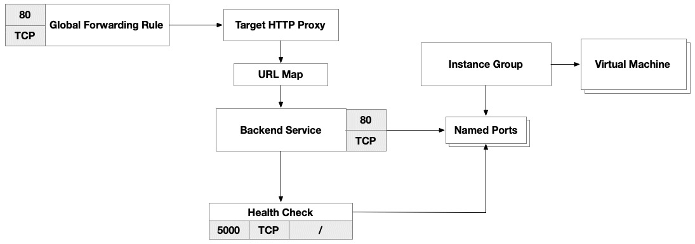
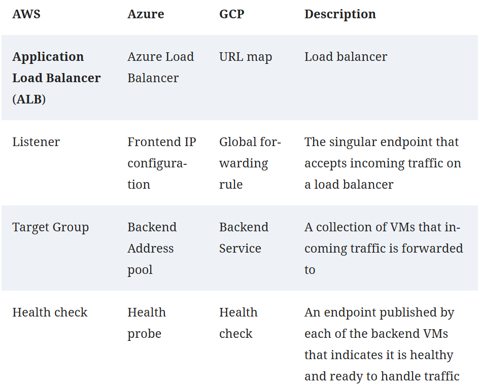
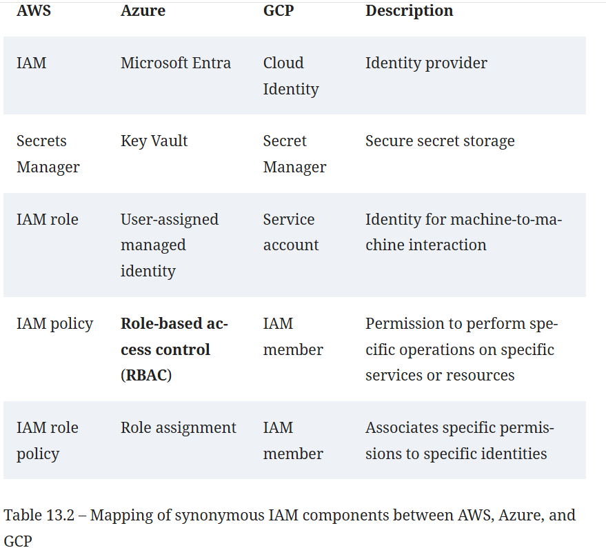
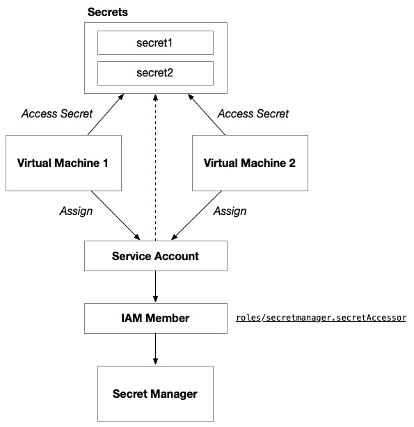
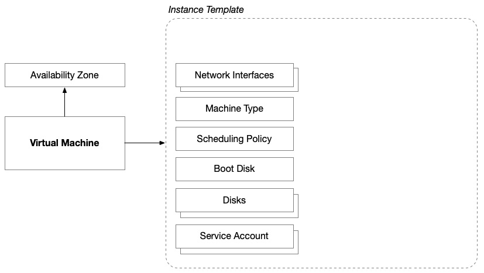
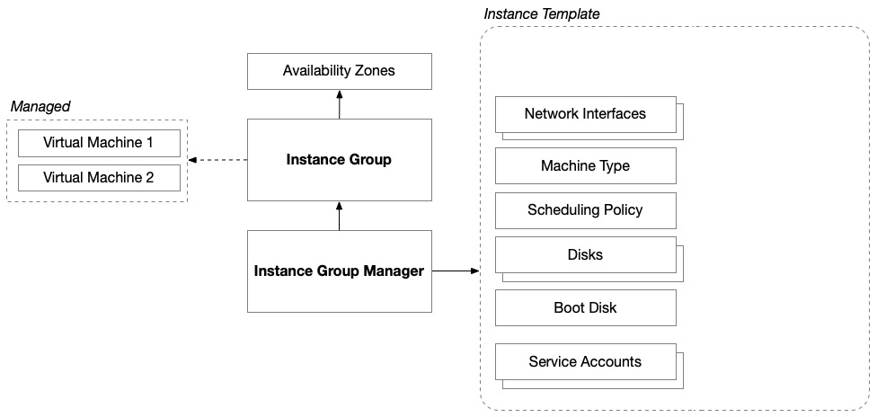

Cloud architecture
we need a project within the organization where a service account can be created for Terraform to use. This service account needs to be granted access to the roles/resourcemanager.projectCreator organizational role. This will allow you to create projects with Terraform, which will allow you to keep a complete solution together 

you need to enable the Cloud Resource Manager API within the project where the Terraform service account resides. 
Your Terraform service account will also need access to Cloud Storage, which you plan on using to store Terraform state. On Google Cloud, this can be accomplished by setting GOOGLE_BACKEND_CREDENTIALS with credentials for the identity you wish to use to communicate with the Google Cloud Storage bucket and GOOGLE_APPLICATION_CREDENTIALS with credentials for the identity you wish to use to communicate with Google Cloud to provision your environment.

Virtual network

Network routing (routes)
by default, Google Cloud networks are global resources, meaning all the subnets (or subnetworks) within a single network can communicate with each other, regardless of their regional location, without the need for explicit routes or VPNs. 
initiate outbound connections to the internet without revealing their IP, Google Cloud provides Cloud NAT
internet connectivity in GCP is managed using a combination of system-generated routes and firewall rules.

Load balancing
Google Cloud has two options when it comes to load balancers: global and regional.
the regional load balancer’s target pool does not allow you to specify a different port for the backend instances. This means the target pool will forward traffic to the same port where it received traffic.

Global LB

The following table extends the mapping that we did between AWS and Azure and includes the GCP equivalents:

Network security
hat GCP firewall rules are stateful

Secrets management

VM:
Google Cloud Compute Engine instance architecture

Instance group manager architecture

on GCP, VMs are connected to virtual networks using network interfaces. Unlike AWS and Azure, these network interfaces cannot be provisioned independently of the VM and are then attached later.

Google Compute firewall resources that can control network traffic using physical network characteristics such as IP address ranges and logical constructs such as service accounts and tags.

Building the solution

The Google Cloud provider is not scoped to a particular region,doesn’t even need to be scoped to a project.
Google Cloud provider relies on an authentication file, so this will alter how our pipeline tools integrate with Terraform to ensure a Google Cloud solution has the right identity. The GOOGLE_APPLICATION_CREDENTIALS environment variable specifies the path to this file. It is important to note that this file is a JSON file, but it contains secret information; therefore, it should be treated as a credential and protected as such.

Terraform resources
google_compute_network
google_compute_subnetwork

LB
google_compute_global_forwarding_rule
google_compute_target_http_proxy
google_compute_url_map
google_compute_backend_service
google_compute_http_health_check

The global forwarding rule is used in conjunction with a target proxy
and a URL map to distribute incoming traffic to backend services. 
The target proxy terminates the incoming HTTP/TCP connection from the user and makes 
a new connection to the next internal network hop, known as the URL map. 
The URL map defines regular-expression matching patterns to filter the incoming requests 
and forward them to different sets of backend services.

Network security
google_compute_firewall

google_secret_manager_secret
google_secret_manager_secret_version
google_secret_manager_secret_iam_member

VM
google_compute_instance